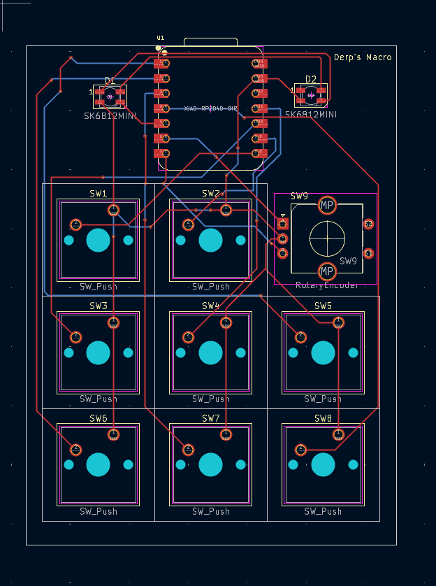
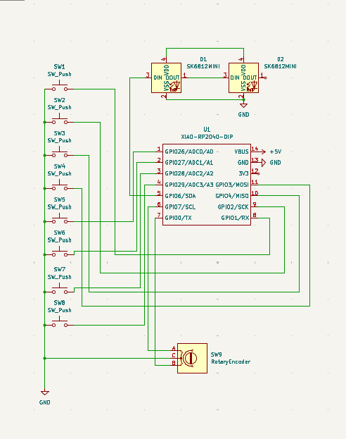
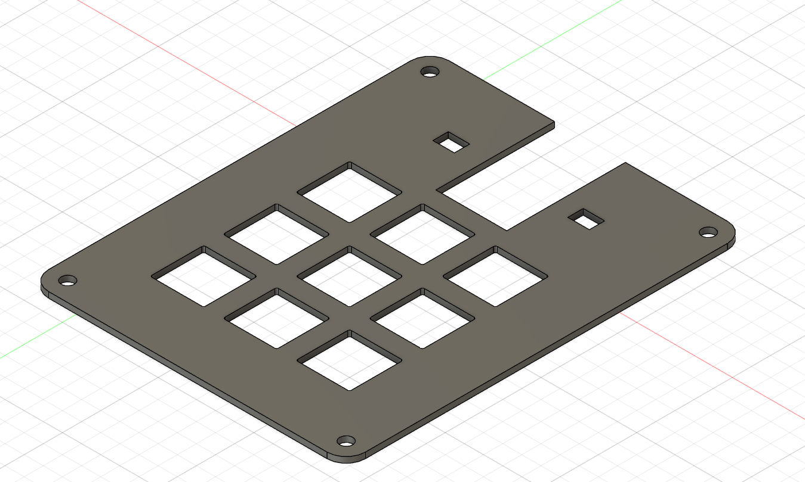
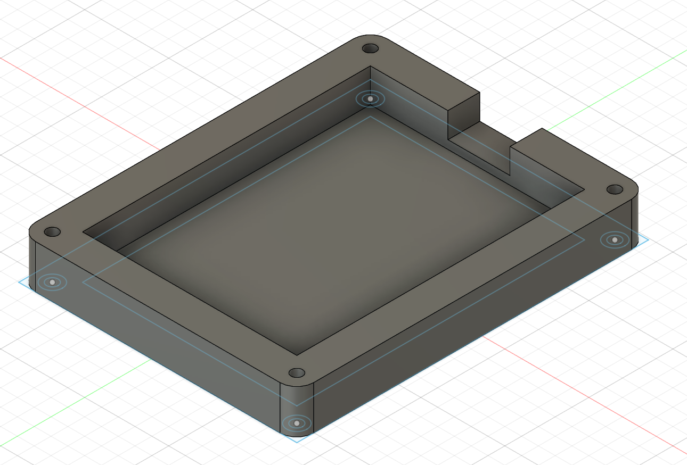
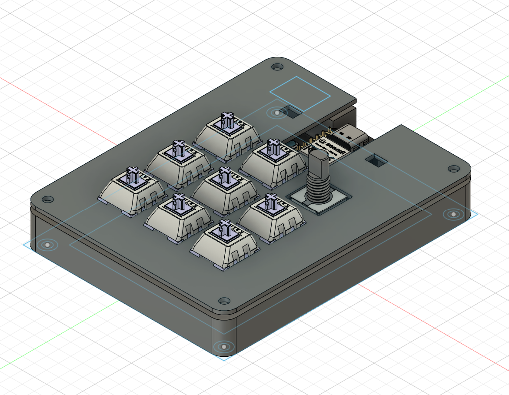

BOM:

- 8x Cherry MX Switches
- 2x SK6812 MINI Leds
- 1x XIAO RP2040
- 8x Blank DSA Keycaps
- 9x M3x16 Bolt
- 9x M3 Heatset
- 1x EC11 Rotary encoders with push-button switch

PCB:

Schematic

Top Case

Bottom Case

Full Case

